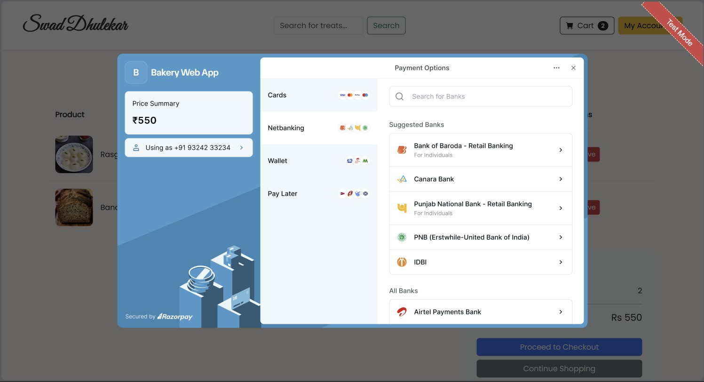

# 🍰 The Cake Shop / Swad Dhulekar - Bakery Web App


**Live Hosted Project:** [Link coming soon...]

This is a full-stack, MVC-architected web application for an online bakery, "The Cake Shop" (also referred to as "Swad Dhulekar"). It provides a complete e-commerce experience, allowing users to browse products, manage their cart, and place orders with a fully integrated **Razorpay Standard Checkout** simulation. It also includes a full admin panel for managing products and customer orders.

---

## 🌟 Features

This application is divided into two main parts: the user-facing storefront and the secure admin backend.

### User Features
* **User Registration & Login:** Secure authentication for customers to create an account and log in.
* **Product Catalog:** A dynamic main page displays all available bakery items (cakes, pastries, breads) with unique descriptions and prices.
* **Search Functionality:** Instantly search for specific treats.
* **User Profile:** Logged-in users can view and seamlessly edit their profile information.
* **Shopping Cart:** Add products to the cart, adjust quantities, and see a summary of the total cost.
* **Razorpay Checkout Integration:** Users can proceed to checkout via a smooth Razorpay modal simulation, creating a secure order flow.
* **Order History:** Users can view all their past and current orders ("My Bills") and check their real-time status.

### Admin Features
* **Admin Login:** A separate, secure login portal for administrators.
* **Admin Dashboard:** A central panel to effortlessly manage the bakery store.
* **Add Products:** Add new products to the inventory, including name, price, quantity, dynamic descriptions, and image URLs.
* **View Products:** View a comprehensive list of all products in the database.
* **Manage Orders (Bills):** View all customer bills, check order details, and update the order status (Pending, Inprogress, Delivered).

---

## 💳 Razorpay Payment Simulation

We have integrated a **Razorpay Standard Web Checkout** simulation into the application. 

When a user proceeds to checkout from their cart, the application:
1. Calls a secure backend API (`/api/create-order`) to generate a unique Razorpay order ID.
2. Opens the official Razorpay payment modal directly on the frontend.
3. Upon a successful mock payment, sends the `razorpay_signature` back to our Node.js backend (`/api/verify-payment`) for SHA256 HMAC verification to ensure security.
4. Updates the user's bill status to "Paid" and clears their cart.



---

## 🛠️ Technologies Used

* **Backend Architecture:** Node.js, Express.js (MVC Pattern: Models, Views, Controllers, Routes)
* **Database:** MySQL (via `mysql2`)
* **Frontend (Templating):** EJS (Embedded JavaScript), Bootstrap 5, Custom CSS
* **Payment Gateway:** Razorpay Node SDK & Checkout.js
* **Security & Session Management:** `express-session`, `crypto`, `dotenv`

---

## 🚀 Setup and Installation

To run this project locally, follow these steps:

### 1. Clone the repository
```bash
git clone https://github.com/Sumit07125/bakery-web-app.git
cd bakery-web-app
```

### 2. Set up the Database
* Ensure you have MySQL server running locally.
* Create the database and seed it using the provided `bakery_app.sql` file:
```sql
CREATE DATABASE IF NOT EXISTS bakery_app;
USE bakery_app;
-- Run the rest of the queries inside bakery_app.sql to create the tables.
```

### 3. Configure Environment Variables
* Open the `db.js` file and update the `host`, `user`, `password`, and `database` fields with your local MySQL credentials.
* Create a `.env` file in the root directory for Razorpay integration:
```env
RAZORPAY_KEY_ID=your_razorpay_key_id
RAZORPAY_KEY_SECRET=your_razorpay_key_secret
```

### 4. Install Dependencies
```bash
npm install
```

### 5. Run the Application
```bash
node app.js
```
The application will be running at `http://localhost:3000`.

---
**Project Documentation:**
All project information, including detailed explanations and screenshots for every feature (user pages, admin panel, cart, profile, etc.), is available in the project PDF.

**[Click here to view the Project PDF (Bakery Web App.pdf)](Bakery%20Web%20App.pdf)**
